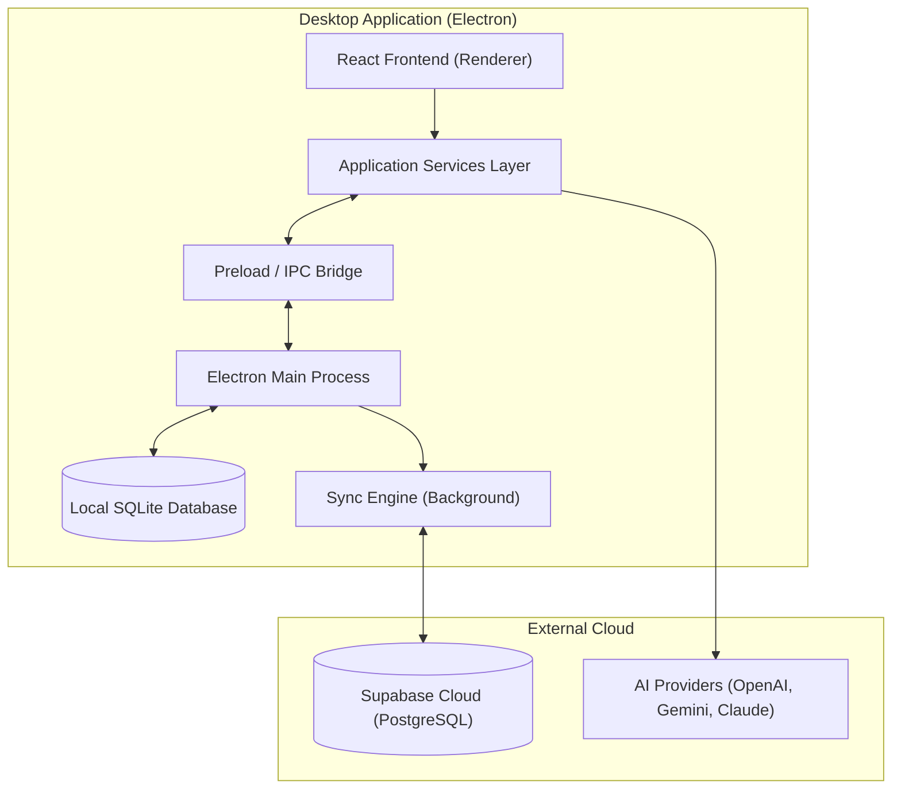

# Architecture Overview

**Write Your Thoughts** uses a modern, offline-first, multi-process architecture to provide a lightning-fast native experience while preserving cloud-sync capabilities.

## High-Level Architecture

## Recommended Stack

- **Desktop Host**: Electron
- **Frontend Framework**: React + TypeScript
- **Styling**: TailwindCSS & custom UI components
- **Editor Core**: Tiptap (Headless rich text editing)
- **Local Database**: SQLite (`sql.js`)
- **Cloud Backend**: Supabase (PostgreSQL, Storage, Auth)
- **State Management**: Zustand

---

## 1. Multi-Process Design

### Renderer Process (React)
The visible UI that handles user interaction. It maintains no direct connections to the local file system or database. All heavy lifting is offloaded to the Main Process.

### The IPC Bridge
Defined in `app/src/preload/index.ts`. It acts as a strict boundary, exposing only specific asynchronous functions (e.g., `window.api.books.getAll()`) to the Renderer.

### Main Process (Electron)
Handles the SQLite database connection, file system operations, window management, and background synchronization queues.

---

## 2. Cloud Synchronization Architecture

The application is built on a **Local-First** philosophy. Users can continue writing without an internet connection, and the UI never freezes to wait for a network response.

### Phase 1: Granular Sync Engine (Local → Cloud)
- **The Sync Queue:** Every mutating database operation (Create, Update, Delete) writes an entry to a local `sync_queue` table in SQLite.
- **Background Processing:** The `syncService.ts` continuously monitors this queue. If there is an active internet connection, it pushes the changes to Supabase in batches.
- **Resilience:** If the user goes offline, changes pool safely in the queue. When they reconnect, the queue seamlessly empties to the cloud.

### Phase 2: Asset Synchronization
- **Binary Data:** Images, Book Covers, and Character Portraits are never stored as Base64 strings in the database.
- **Supabase Storage:** Files are written to the local filesystem first. In the background, they are uploaded to a Supabase Storage bucket, and a `cloud_url` is returned and saved.

### Phase 3: Multi-Device Support (Cloud → Local)
- **Incremental Pull:** During normal boot, the system checks the `updated_at` timestamps of local tables and pulls any missing individual records from the cloud.
- **Realtime Websockets:** The app uses Supabase Realtime Channels. When an edit is made on Device A, Device B receives a WebSocket payload and silently merges the update into its local database, triggering a UI refresh.

### Phase 4: Dual-Layer Version History
- **Layer 1: Granular Autosaves (Local-Only):** The app saves local snapshots of the active chapter every 15 minutes of continuous writing. These are kept strictly local.
- **Layer 2: Cloud Milestones (Synced):** Users can explicitly save "Milestones" which are pushed to the `cloud_chapter_versions` table via the Sync Queue.

## Conflict Resolution

In a single-user architecture, conflict resolution heavily favors the most recent write based on `updated_at` timestamps. Before any destructive overwrite from the cloud occurs, a local snapshot is captured in the version history, guaranteeing no local draft is ever permanently lost.
